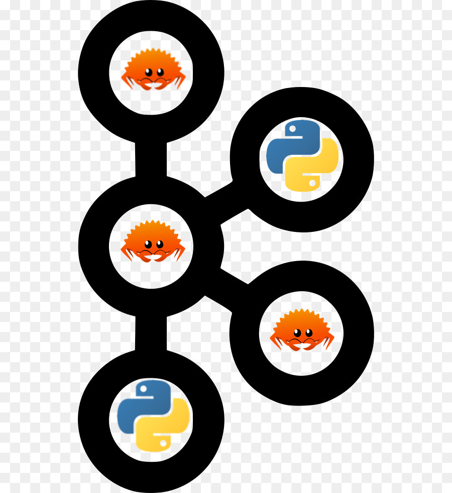

# libkafka

Easy as pie rust lib for Kafka with python bindings.

<!--  -->

## Build for rust

Add this to your `Cargo.toml`:

```toml
[dependencies]
libkafka = { git = "git@gitlab.w6d.io:w6d/ia/ml/libkafka.git" }
```

```bash
cargo build --release
ls ./target/release/libkafka.rlib
```

```rust
use libkafka::{produce, consume};

produce("KAFKA_TOPIC", "hello world");
consume("KAFKA_TOPIC");
```

## Build for python

Build and rename from `libkafka.dylib` to `kafka.so` (renaming is important)
```bash
cargo build --release --features "python"
cp ./target/release/libkafka.dylib kafka.so
```

Then simply copy the `kafka.so` file to the root of your python project and simply :

```python
from kafka import consume, produce

produce("KAFKA_TOPIC", "hello world")
consume("KAFKA_TOPIC")
```
